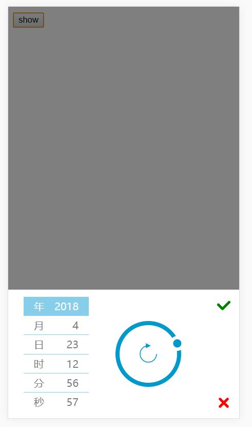

# 移动端转盘时间选择器

Demo 链接：http://skywingjiang.gitee.io/timeselectordial

## 主要特点

- 时间选择
- 移动端，触摸旋转
- 简单地修改 CSS 就可以修改样式

## 依赖技术

- HTML，CSS，Javascript
- SVG

## 图片



## 用法

1. 引入 TimeSelectorDial.js

```html
<script src="TimeSelectorDial.js"></script>
```

脚本会创建 window 属性 TimeSelectorDial。

2. 实例化类

```javascript
let timeSelectorDial = new TimeSelectorDial()
```

timeSelectorDial 适用于管理 DOM 对象的虚拟对象。

3. 添加 DOM 对象

```javascript
body.appendChild(timeSelectorDial.dom)
```

timeSelectorDial.dom 指向真正 DOM 元素。

4. 显示 DOM 对象

```javascript
let callback = function ({ year, month, day, hour, minute, second }) {}
timeSelectorDial.show(callback)
```

显示 DOM 对象并传入回调函数。若点击确认按钮则向回调函数传入时间对象，若点击取消按钮则向回调函数传入 null。
